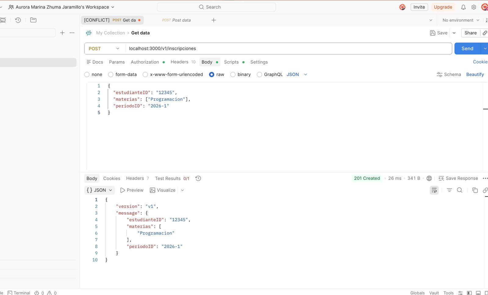
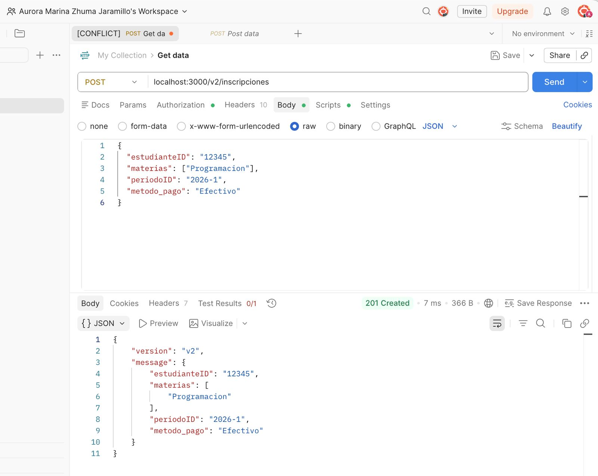
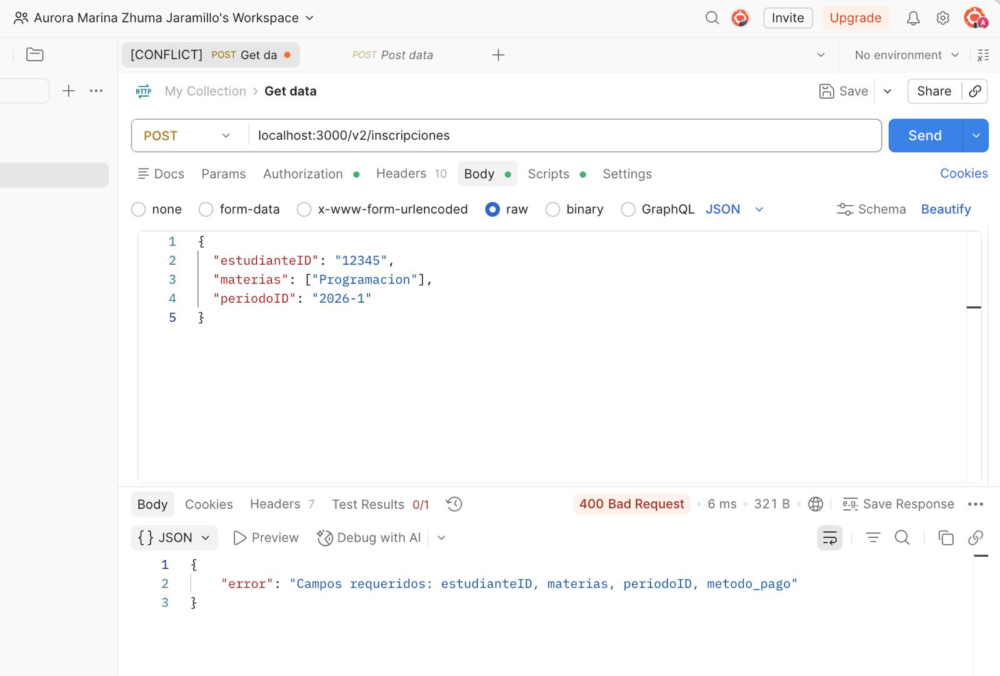
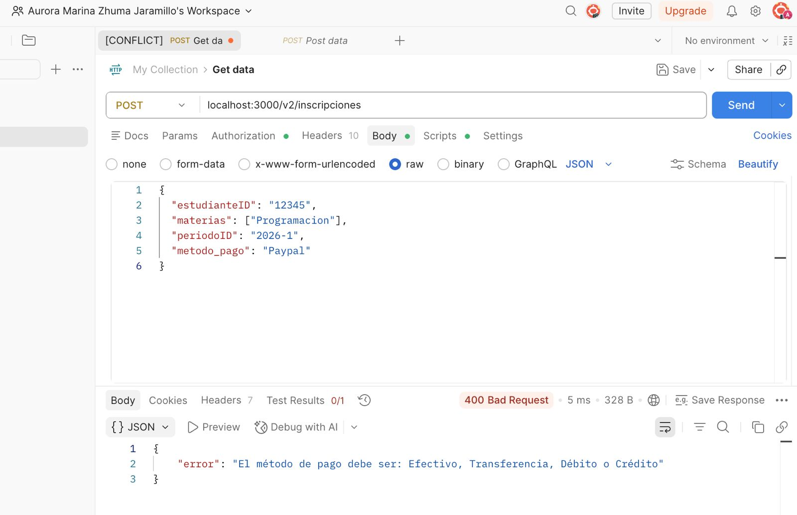
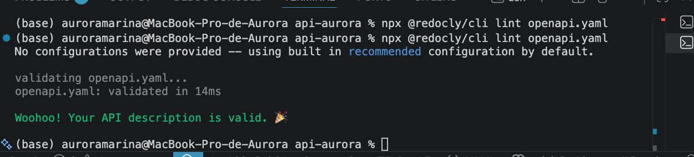
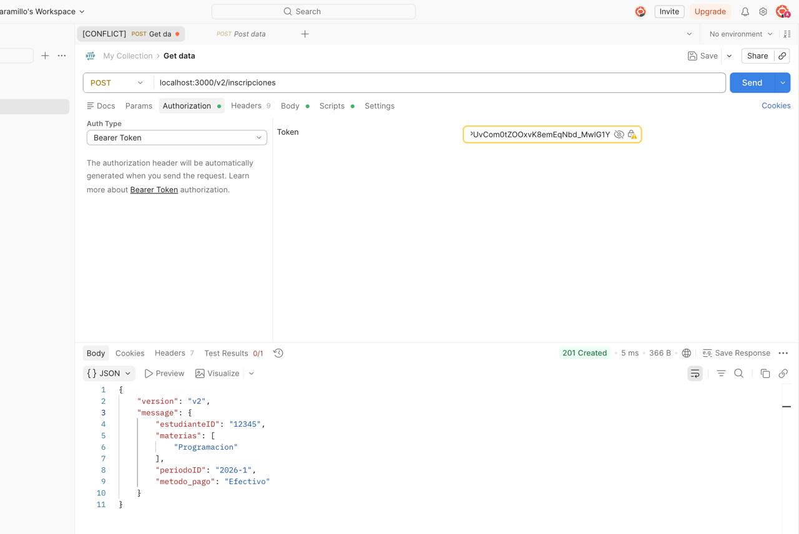
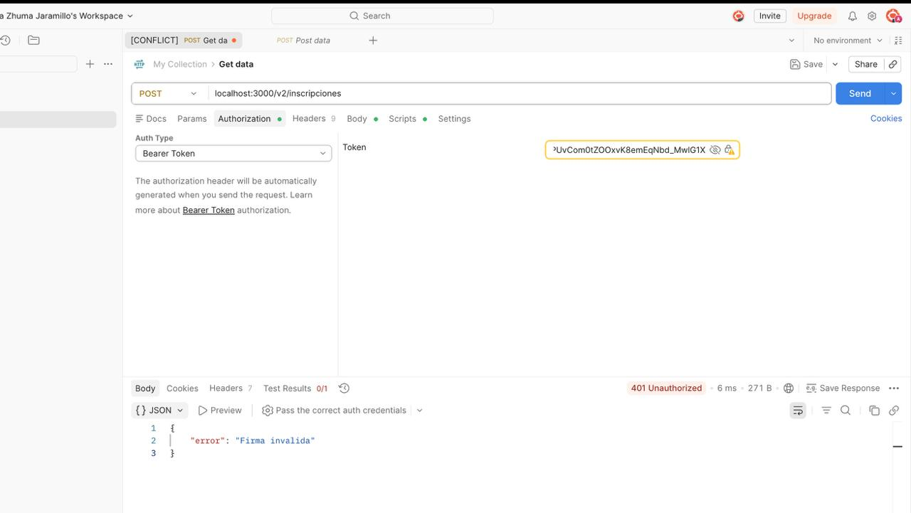
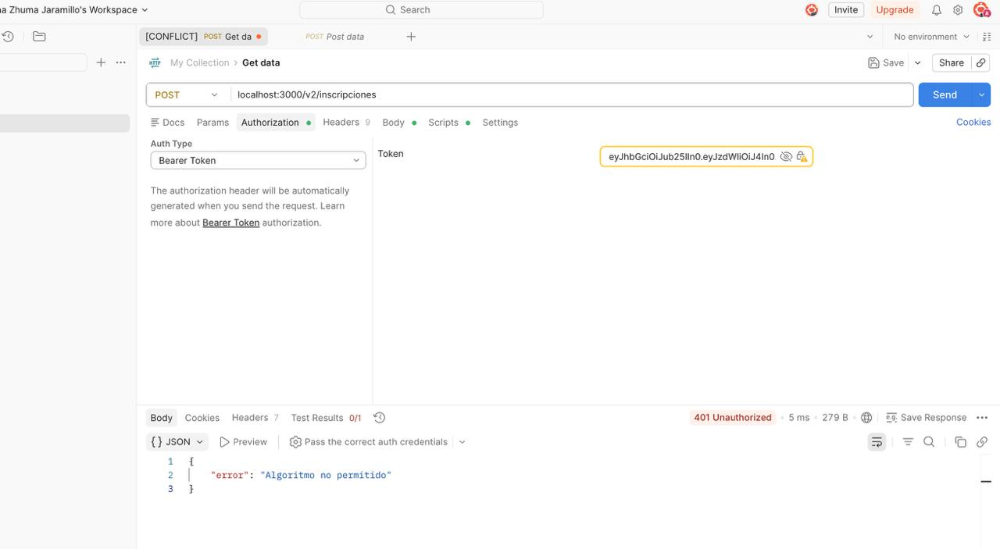
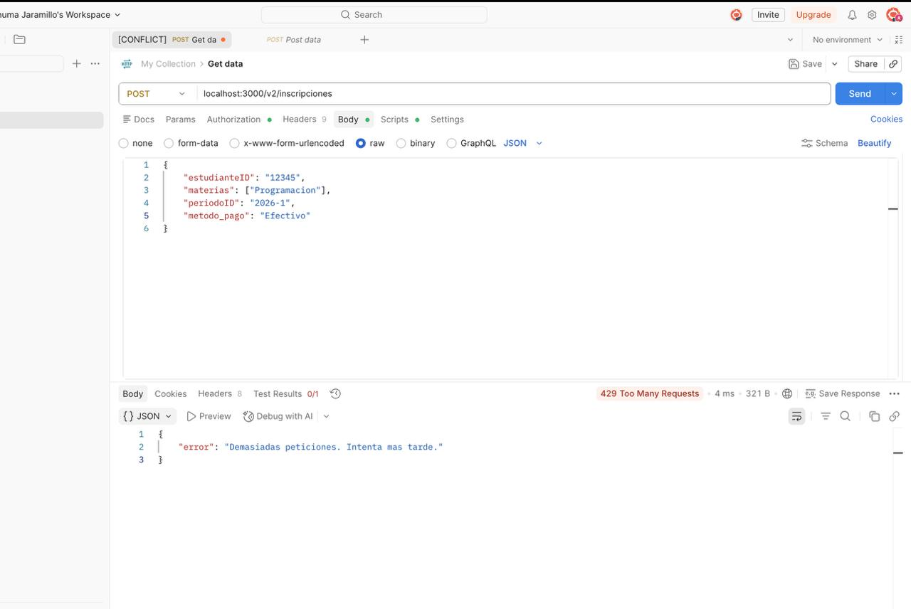

# ACTIVIDAD PE-2.1

## Actividad 1
El escenario tiene este comando:
curl http://localhost:3000/health

Y la salida es:

{"error":"API key inválida o ausente"}

Justificación:
El middleware de autenticación detecta que no se envió y responde con error 401.

## Actividad 2
El escenario tiene este comando:

curl -H "x-api-key: secreto-demo" http://localhost:3000/health

Y la salida es:

{"status":"ok","ts":"2026-06-11T20:47:08.694Z"}

Justificación:

La API key salió válida, por lo que el middleware permite que se de el acceso y la ruta /health esta bien.

## Actividad 3
El escenario tiene este comando:

curl -H "x-api-key: secreto-demo" http://localhost:3000/noexiste

Y la salida es:

Cannot GET /noexiste

Justificación:
La ruta no existe en la aplicación, entonces Express responde con error 404.

# ACTIVIDAD TA-2.1

Para esta actividad se ejecutaron la spruebas unitarias con el comando:

npm test

Lo que se obtuvo de la salida es:

> api-aurora@1.0.0 test
> jest

 PASS  src/auth.test.ts
 PASS  src/logger.test.ts

Test Suites: 2 passed, 2 total
Tests:       5 passed, 5 total
Snapshots:   0 total
Time:        0.198 s, estimated 1 s
Ran all test suites.

Estas pruebas que se ejecutaron nos permiten analizar que el middleware logger es el que registra el método y la ruta de forma efectiva, e invoca next(). También, el middleware de API key devuelve con 401 cunado el header no existe o la clave no es correcta. En cambio, cuando la clave es válida permite el acceso. 

# PE-2.2 Documentación y versionado de API

## Endpoint

Este endpoint permite registrar la matrícula de un estudiante indicando sus materias, período académico y método de pago.
Los datos de entrada son:

x-api-key: secreto-demo

Body JSON:

{
  "estudianteID": "12345",
  "materias": ["Programación", "Bases de Datos"],
  "periodoID": "2026-1",
  "metodo_pago": "Efectivo"
}

Respuesta que se recibio exitosamente es: (201 Created)

{
  "version": "v1",
  "message": {
    "estudianteID": "12345",
    "materias": ["Programación", "Bases de Datos"],
    "periodoID": "2026-1",
    "metodo_pago": "Efectivo"
  }
}
Los errores:
Error 400 Bad Request

Y cuando falta algunos campos obligatorios:

{
  "error": "Campos requeridos: estudianteID, materias, periodoID"
}
Error 400 Bad Request

{
  "error": "El método de pago insertado debe ser: efectivo, debito credito y tarjeta"
}

## Versionado

### Cambio compatible con las versiones 

Agregar un nuevo campo opcional llamado correo en la solicitud de inscripción sería un cambio compatible. 

### Cambio que rompe la compatibilidad 

Cambiar el campo metodo_pago para que sea obligatorio cuando antes era opcional sería un cambio incompatible. Tendrían que modificar su implementación para seguir funcionando correctamente.
=======
# ACTIVIDAD PE-2.1

## Actividad 1
El escenario tiene este comando:
curl http://localhost:3000/health

Y la salida es:

{"error":"API key inválida o ausente"}

Justificación:
El middleware de autenticación detecta que no se envió y responde con error 401.

## Actividad 2
El escenario tiene este comando:

curl -H "x-api-key: secreto-demo" http://localhost:3000/health

Y la salida es:

{"status":"ok","ts":"2026-06-11T20:47:08.694Z"}

Justificación:

La API key salió válida, por lo que el middleware permite que se de el acceso y la ruta /health esta bien.

## Actividad 3
El escenario tiene este comando:

curl -H "x-api-key: secreto-demo" http://localhost:3000/noexiste

Y la salida es:

Cannot GET /noexiste

Justificación:
La ruta no existe en la aplicación, entonces Express responde con error 404.

# ACTIVIDAD TA-2.1

Para esta actividad se ejecutaron la spruebas unitarias con el comando:

npm test

Lo que se obtuvo de la salida es:

> api-aurora@1.0.0 test
> jest

 PASS  src/auth.test.ts
 PASS  src/logger.test.ts

Test Suites: 2 passed, 2 total
Tests:       5 passed, 5 total
Snapshots:   0 total
Time:        0.198 s, estimated 1 s
Ran all test suites.

Estas pruebas que se ejecutaron nos permiten analizar que el middleware logger es el que registra el método y la ruta de forma efectiva, e invoca next(). También, el middleware de API key devuelve con 401 cunado el header no existe o la clave no es correcta. En cambio, cuando la clave es válida permite el acceso. 

# PE-2.2 Documentación y versionado de API

## Endpoint

Este endpoint permite registrar la matrícula de un estudiante indicando sus materias, período académico y método de pago.
Los datos de entrada son:

x-api-key: secreto-demo

Body JSON:

{
  "estudianteID": "12345",
  "materias": ["Programación", "Bases de Datos"],
  "periodoID": "2026-1",
  "metodo_pago": "Efectivo"
}

Respuesta que se recibio exitosamente es: (201 Created)

{
  "version": "v1",
  "message": {
    "estudianteID": "12345",
    "materias": ["Programación", "Bases de Datos"],
    "periodoID": "2026-1",
    "metodo_pago": "Efectivo"
  }
}
Los errores:
Error 400 Bad Request

Y cuando falta algunos campos obligatorios:

{
  "error": "Campos requeridos: estudianteID, materias, periodoID"
}
Error 400 Bad Request

{
  "error": "El método de pago insertado debe ser: efectivo, debito credito y tarjeta"
}

## Versionado

### Cambio compatible con las versiones 

Agregar un nuevo campo opcional llamado correo en la solicitud de inscripción sería un cambio compatible. 

### Cambio que rompe la compatibilidad 

Cambiar el campo metodo_pago para que sea obligatorio cuando antes era opcional sería un cambio incompatible. Tendrían que modificar su implementación para seguir funcionando correctamente.

## Evidencias de pruebas

 Escenario 1 - POST /v1/inscripciones (201 Created)

Escenario 2 - POST /v2/inscripciones con método de pago válido (201 Created)

Escenario 3 - POST /v2/inscripciones sin metodo_pago (400 Bad Request)

Escenario 4 - POST /v2/inscripciones con metodo_pago inválido (400 Bad Request)

## Evidencia de validación

### Resultado de Redocly CLI

## Reflexión

Si en cambio otro equipo empezara a utilizar esta API, el contrato OpenAPI se vería enriquecido cuando menos con ejemplos de todas las peticiones y respuestas, incluidos los errores. También especificaría esquemas reutilizables para cada versión de la API y explicaría con mayor profundidad la autenticación mediante API Key. Estos cambios contribuirían a, por un lado, facilitar la integración de aplicaciones externas, y por el otro, a reducir errores durante el desarrollo e incrementar la comprensión, en términos generales, del funcionamiento de la API.

# PE-2.3 Seguridad JWT

## Generación del token

Para generar un token JWT se utilizó este comando:

node generate-token.mjs

## Ejecución del servidor

Para iniciar el servidor se ejecutó:

npm run dev

## Evidencias de pruebas

### Escenario 1 = token válido 201 Created

Se envió un token JWT válido y la API respondió correctamente con 201 Created.

### Escenario 2 = token con firma inválida 401 Unauthorized

Se envió un token con una firma alterada y el middleware respondió con 401 Unauthorized.

### Escenario 3 = token con algoritmo none 401 Unauthorized

Se envió un token con alg:none y el middleware respondió con 401 Unauthorized, así rechazo la petición.

### Escenario 4 = rate Limiter 429 Too Many Requests

Después de superar el límite de solicitudes permitido, el servidor respondió con 429 Too Many Requests.

